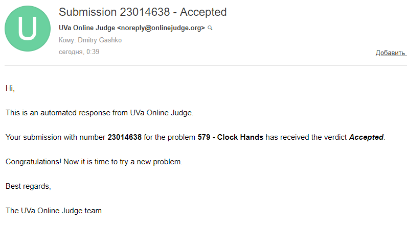
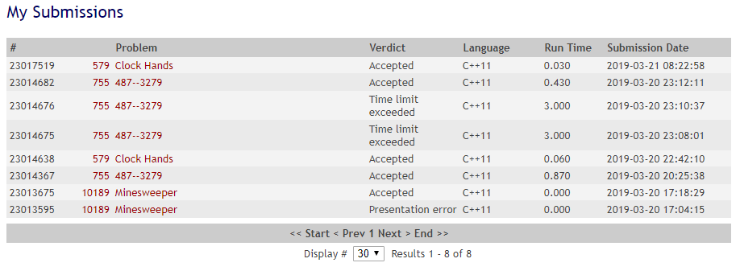

# School-Postindustria-03-2019

Program: [school.postindustria.com](https://school.postindustria.com/)

## Start tasks

### Tasks

1. [Minesweeper](https://uva.onlinejudge.org/index.php?option=com_onlinejudge&Itemid=8&category=13&page=show_problem&problem=1130)
1. [487--3279](https://uva.onlinejudge.org/index.php?option=com_onlinejudge&Itemid=8&page=show_problem&problem=696)
1. [Clock Hands](https://uva.onlinejudge.org/index.php?option=com_onlinejudge&Itemid=8&page=show_problem&problem=520)

### Solution

- [Solution Folder](./other/report/)
- [C++ solution](./other/report/cppSolution)
- [TS Solution](./other/report/tsSolution)

### Results






## TS solution build

Install dependencies:

```bash
yarn
```

Development:

```bash
yarn start # host: http://localhost:8080/
```

Build:

```bash
yarn build
```

Build server:

```bash
yarn static # host: http://localhost:8000/
```

Run tests:

```bash
yarn test
```